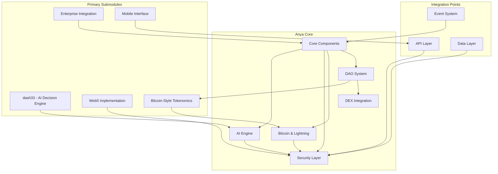
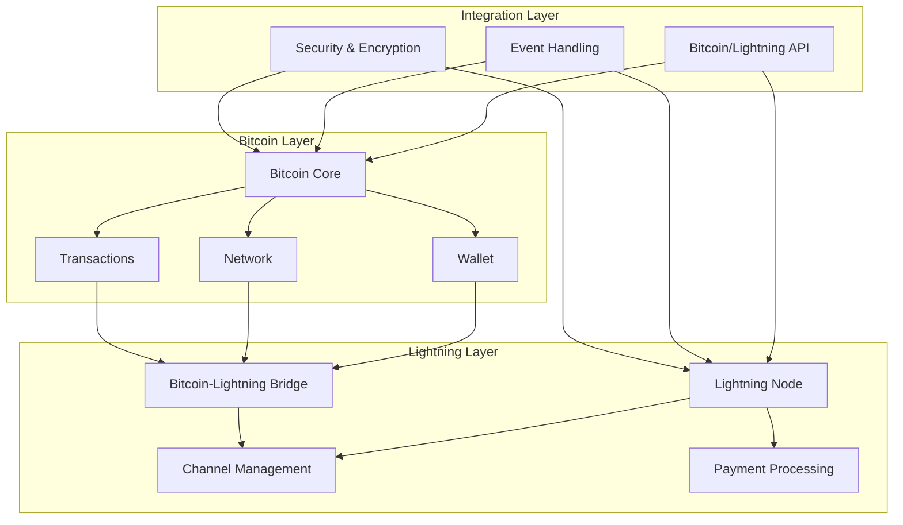
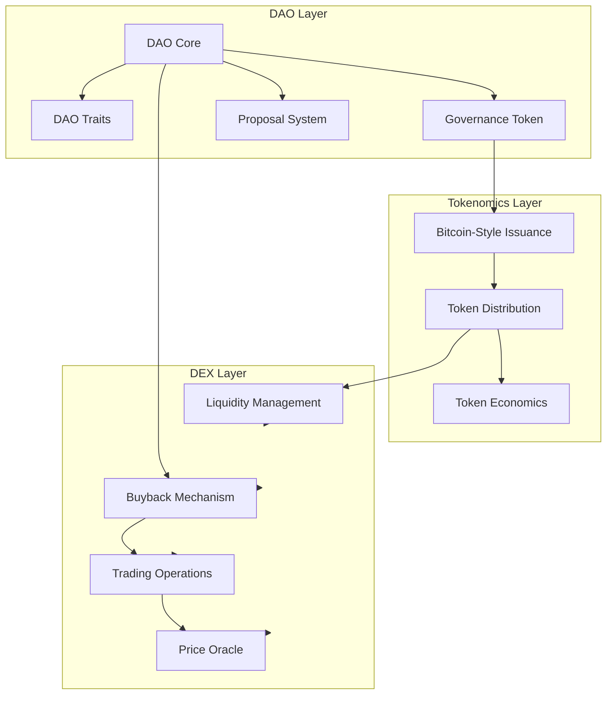
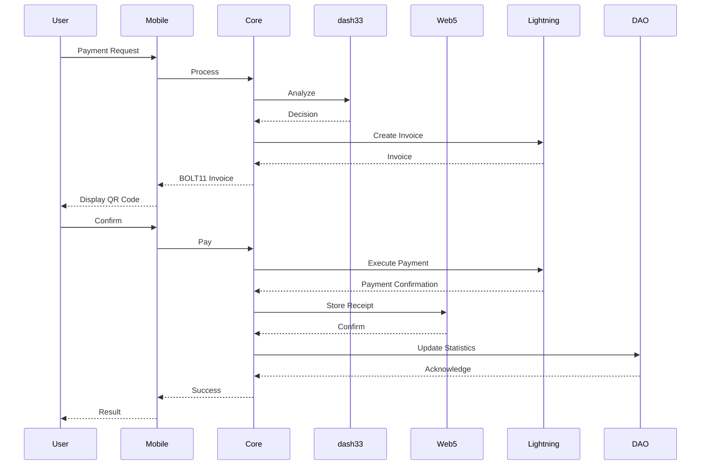
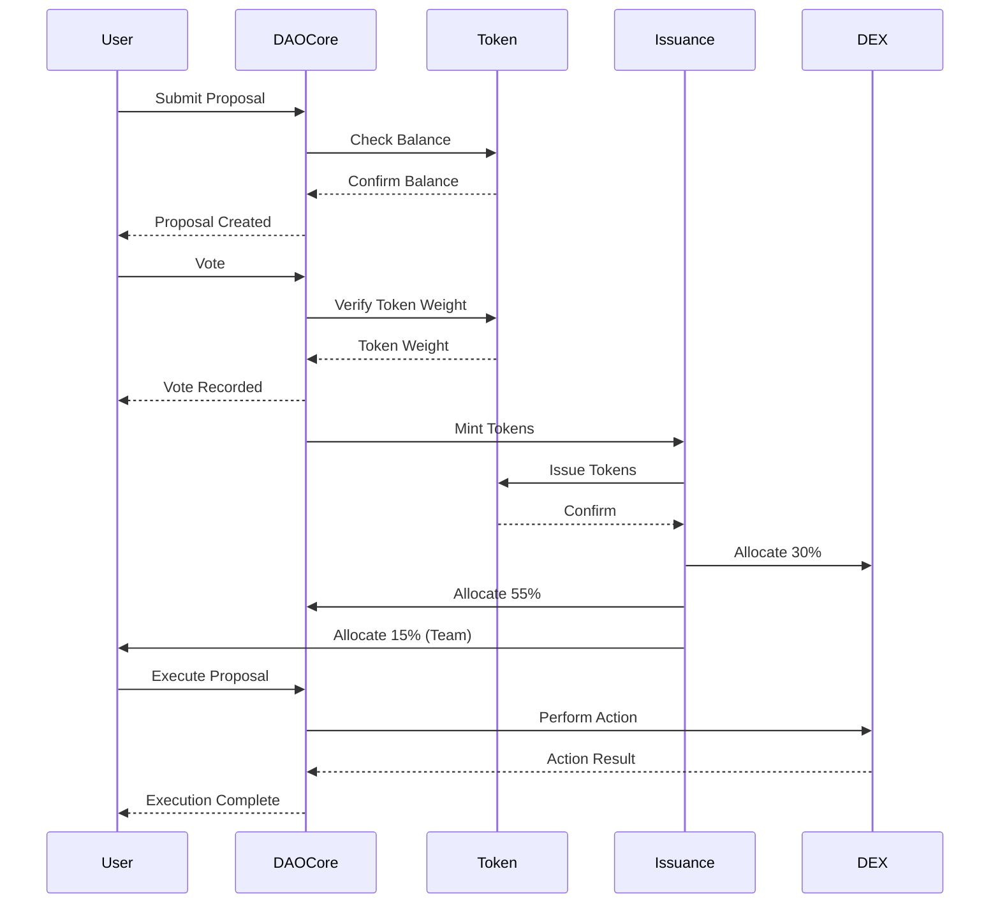
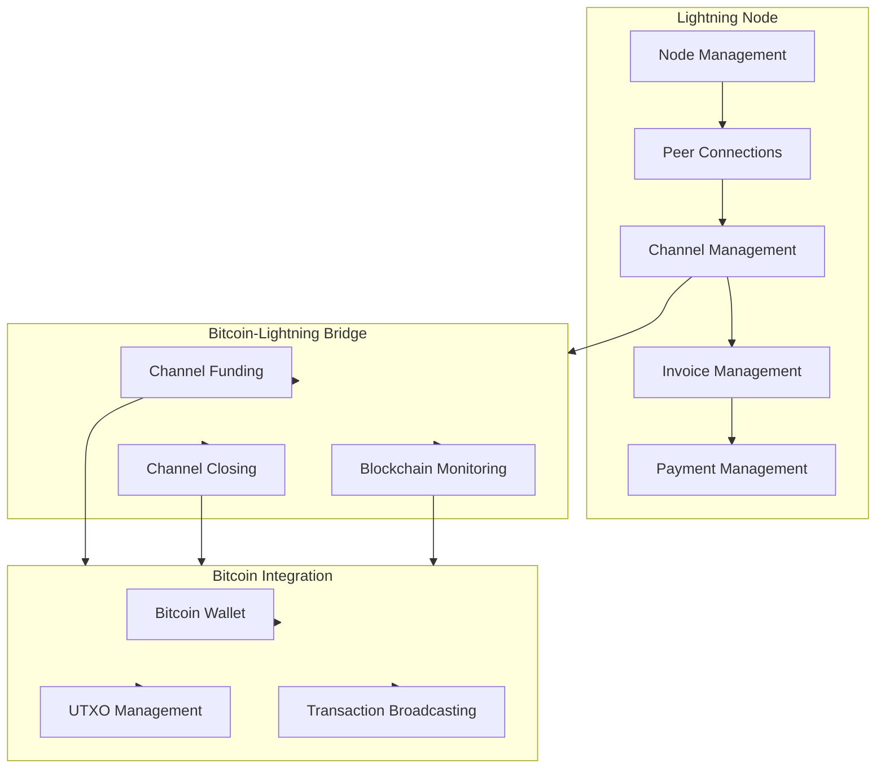
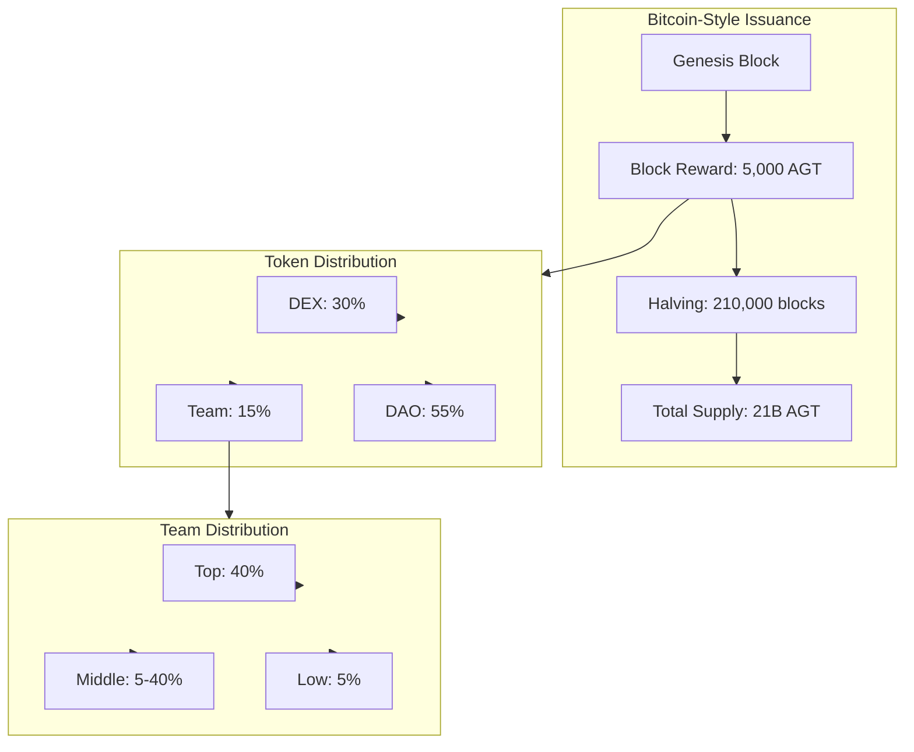
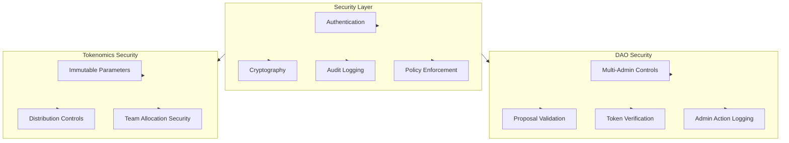

# Anya Core System Architecture

## Repository Structure



## Component Details

### Core Repository
1. **Core Components**
   - Base system functionality
   - Configuration management
   - Service orchestration
   - Resource management

2. **AI Engine**
   - Model management
   - Decision making
   - Learning systems
   - Performance optimization

3. **Security Layer**
   - Access control
   - Encryption
   - Audit logging
   - Policy enforcement
   
4. **Bitcoin & Lightning**
   - Bitcoin protocol implementation
   - Lightning Network integration
   - Payment channels
   - Wallet management

5. **DAO System**
   - Decentralized governance
   - Proposal management
   - Voting mechanisms
   - Administrative controls
   - Bitcoin-style tokenomics
   - DEX integration

6. **DEX Integration**
   - Liquidity provision (30% allocation)
   - Trading operations
   - Buyback mechanism
   - Price oracle

### Bitcoin & Lightning Architecture


### DAO System Architecture


### Submodules

1. **dash33 (AI Decision Engine)**
   ```mermaid
   graph LR
       Core[Core Engine]
       Analytics[Analytics]
       Models[Models]
       API[API]

       Core --> Analytics
       Core --> Models
       Core --> API
   ```

2. **Enterprise Integration**
   ```mermaid
   graph LR
       Core[Enterprise Core]
       Auth[Authentication]
       Admin[Administration]
       Integration[Integration]

       Core --> Auth
       Core --> Admin
       Core --> Integration
   ```

3. **Mobile Interface**
   ```mermaid
   graph LR
       Core[Mobile Core]
       UI[UI Components]
       Services[Services]
       State[State Management]

       Core --> UI
       Core --> Services
       Core --> State
   ```

4. **Web5 Implementation**
   ```mermaid
   graph LR
       Core[Web5 Core]
       DID[DID System]
       Storage[Storage]
       Protocol[Protocol]

       Core --> DID
       Core --> Storage
       Core --> Protocol
   ```

5. **Bitcoin-Style Tokenomics**
   ```mermaid
   graph LR
       Core[Tokenomics Core]
       Issuance[Bitcoin-Style Issuance]
       Distribution[Distribution System]
       Halving[Halving Mechanism]

       Core --> Issuance
       Core --> Distribution
       Core --> Halving
   ```

## Integration Architecture



## DAO System Flow



## Lightning Network Component Flow



## Tokenomics System Flow



## Security Model



## Cross-References

For detailed information about specific components, please see the following documentation:

- [DAO System Documentation](DAO_INDEX.md)
- [Tokenomics System](TOKENOMICS_SYSTEM.md)
- [DAO System Map](DAO_SYSTEM_MAP.md)
- [Implementation Milestones](IMPLEMENTATION_MILESTONES.md)
- [DAO System Guide](DAO_SYSTEM_GUIDE.md)
- [Bitcoin Documentation](/bitcoin/index.html)
- [Web5 Documentation](/web5/index.html)

## Implementation Status

Current implementation status:
- ✅ Core architecture and interfaces
- ✅ Bitcoin-style issuance model with 21 billion token supply
- 🔄 Distribution allocation mechanisms (In Progress)
- ⏳ DEX integration (Pending)
- ⏳ Advanced governance features (Pending)

For detailed progress, see the [Implementation Milestones](IMPLEMENTATION_MILESTONES.md) document.

*Last updated: 2025-03-04*
